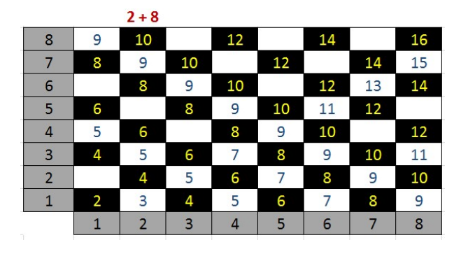

# Mantiqiy amallarga oid masalalar

> #### Ushbu guruhdagi barcha masalalarda mantiqiy ifoda qiymati rost bo’lsa **true (1)**, aks holda **false (0)** qaytarilsin. 

> #### Raqamlari soni ko’rsatilgan barcha sonlarni (ikki xonali son, uch xonali son va h. k.) musbat butun sonlar deb hisoblansin.

---

**Boolean1.** A butun soni berilgan. Jumlani rostlikka tekshiring: “A soni musbat”.

**Boolean2.** A butun soni berilgan. Jumlani rostlikka tekshiring: “A soni toq son”.

**Boolean3.** A butun soni berilgan. Jumlani rostlikka tekshiring: “A soni juft son”.

**Boolean4.** Ikkita butun A va B sonlari berilgan. Jumlani rostlikka tekshiring: “A>2 va B<=3”.

**Boolean5.** Ikkita butun A va B sonlari berilgan. Jumlani rostlikka tekshiring: “A >= 0 yoki B < -2”

**Boolean6.** Uchta A, B, C butun sonlar berilgan. Jumlani rostlikka tekshiring: “A<= B <= C”

**Boolean7.** Uchta A, B, C butun sonlar berilgan. Jumlani rostlikka tekshiring: “B soni A va C sonlari orasida yotadi”.

**Boolean8.** Ikkita butun A va B sonlari berilgan. Jumlani rostlikka tekshiring: “A va B sonlari toq sonlar”.

**Boolean9.** Ikkita butun A va B sonlari berilgan. Jumlani rostlikka tekshiring: “A va B sonlarning hech bo’lmaganda bittasi toq son”.

**Boolean10.** Ikkita butun A va B sonlari berilgan. Jumlani rostlikka tekshiring: “A va B sonlarning 
faqat bittasi toq son”.

**Boolean11.** Ikkita butun A va B sonlari berilgan. Jumlani rostlikka tekshiring: “A va B sonlarining 
har ikkalasi ham yoki toq son yoki juft son”.

**Boolean12.** Uchta A, B, C butun sonlar berilgan. Jumlani rostlikka tekshiring: “A, B, C sonlarning har biri musbat”.

**Boolean13.** Uchta A, B, C butun sonlar berilgan. Jumlani rostlikka tekshiring: “A, B, C sonlarning hech bo’lmaganda bittasi musbat”.

**Boolean14.** Uchta A, B, C butun sonlar berilgan. Jumlani rostlikka tekshiring: “A, B, C sonlaridan faqat bittasi musbat son”.

**Boolean15.** Uchta A, B, C butun sonlar berilgan. Jumlani rostlikka tekshiring: “A, B, C sonlardan faqat ikkitasi musbat son”.

**Boolean16.** Musbat butun son berilgan. Jumlani rostlikka tekshiring: “Berilgan son ikki xonali juft 
son”.

**Boolean17.** Musbat butun son berilgan. Jumlani rostlikka tekshiring: “Berilgan son uch xonali toq” .

**Boolean18.** Jumlani rostlikka tekshiring: "Berilgan uchta butun sonlarning hech bo'lmaganda 2 tasi bir biriga teng".

**Boolean19.** Jumlani rostlikka tekshiring: "Berilgan uchta butun sonlarning hech bo'lmaganda bir jufti o'zaro qarama qarshi".

**Boolean20.** Uch xonali son berilgan. Jumlani rostlikka tekshiring: "Ushbu sonning barcha raqamlari xar xil".

**Boolean21.** Uch xonali son berilgan. Jumlani rostlikka tekshiring: "Ushbu sonning raqamlari ketama-ket o'suvchi bo'lib joylashgan".

**Boolean22.** Uch xonali son berilgan. Jumlani rostlikka tekshiring: "Ushbu sonning raqamlari ketama-ket o'suvchi bo'lib joylashgan yoki kamayuvchi ketma-ketlikka ega".

**Boolean23.** Uch xonali son berilgan. Jumlani rostlikka tekshiring: "Ushbu sonni chapdan o'qiganda ham, o'ngdan o'qiganda ham bir xil".

**Boolean24.** A, B, C sonlar beilgan (A soni noldan farqli). D=B2-4AC diskerminantdan foydalanib, jumlani rostlikka tekshiring: "Ax2+Bx+C=0 kvadrat tenglama haqiqiy ildizga ega".

**Boolean25.** x, y sonlar berilgan. Jumlani rostlikka tekshiring: "Koordinatalari (x,y) bo'lgan nuqta, 
koordinata choragining ikkinchisida yotadi".

**Boolean26.** x,y sonlar berilgan. Jumlani rostlikka tekshiring: "Koordinatalri (x,y) bo'lgan nuqta koordinata choragining to'rtinchisida yotadi".

**Boolean27.** x, y sonlar berilgan. Jumlani rostlikka tekshiring: "Koordinatalri (x,y) bo'lgan nuqta 
koordinata choragining ikkinchisida yoki uchunchisida yotadi".

**Boolean28.** x, y sonlar berilgan. Jumlani rostlikka tekshiring: "Koordinatalri (x,y) bo'lgan nuqta koordinata choragining birinchi yoki uchunchisida yotadi".

**Boolean29.** (x, y), (x1, y1), (x2, y2) sonlari berilgan. Jumlani rostlikka tekshiring: "Koordinatalari (x,y) bo'lgan nuqta, chap yuqori cho'qqisi (x1,y1) koordinatalarga ega bo'lgan va o'ng pastikisi (x2,y2) bo'lgan, tomonlari esa koordinata o'qlariga parallel bo'lgan to'rtburchak ichida yotadi".

**Boolean30.** a, b, c butun sonlari berilgan. Jumlani rostlikka tekshiring: "a, b, c tomonli uchburchak 
teng tomonli bo'ladi".

**Boolean31.** a, b, c butun sonlari berilgan. Jumlani rostlikka tekshiring: "a, b, c tomonli uchburchak teng yonli bo'ladi".

**Boolean32.** a, b, c butun sonlar berilgan. Jumlani rostlikka tekshiring: "a, b, c tomonli uchburchak to'g'ri burchakli".

**Boolean33.** a, b, c butun sonlar berilgan. Jumlani rostlikka tekshiring: "a, b, c tomonli uchburchak 
yasash mumkin".

**Boolean34.** Shaxmat doskasining x, y koordinatalari berilgan (1-8 oraliqda yotuvchi butun sonlar). Doskaning chap pastki maydoni (1,1) qoraligini hisobga olib, jumlani rostlikka tekshiring: "Berilgan (x, y) maydon oq".

**Boolean35.** Shaxmat doskasining ikkita turli (x1, y1), (x2, y2) koordinalari berilgan (1-8 oraliqda yotuvchi butun sonlar). Jumlani rostlikka tekshiring: "Berilgan maydonlar bir xil rangda".

**Boolean36.** Shaxmat doskasining ikkita turli (x1, y1), (x2, y2) koordinalari berilgan (1-8 oraliqda yotuvchi butun sonlar). Jumlani rostlikka tekshiring: "Ruh bir yurishda bir maydondan ikkinchisiga o'ta oladi".

**Boolean37.** Shaxmat doskasining ikkita turli (x1, y1), (x2, y2) koordinalari berilgan (1-8 oraliqda yotuvchi butun sonlar). Jumlani rostlikka tekshiring: "Shoh bir yurishda bir maydondan ikkinchisiga o’ta oladi."

**Boolean38.** Shaxmat doskasining ikkita turli (x1, y1), (x2, y2) koordinalari berilgan (1-8 oraliqda yotuvchi butun sonlar). Jumlani rostlikka tekshiring: "Fil bir yurishda bir maydondan ikkinchisiga o'ta oladi".

**Boolean39.** Shaxmat doskasining ikkita turli (x1, y1), (x2, y2) koordinalari berilgan (1-8 oraliqda yotuvchi butun sonlar). Jumlani rostlikka tekshiring: “Farzin bir yurishda bir maydondan 
ikkinchisiga o’ta oladi”.

**Boolean40.** Shaxmat doskasining ikkita turli (x1, y1), (x2, y2) koordinalari berilgan (1-8 oraliqda yotuvchi butun sonlar). Jumlani rostlikka tekshiring: "Ot bir yurishda bir maydondan ikkinchisiga o'ta oladi".

